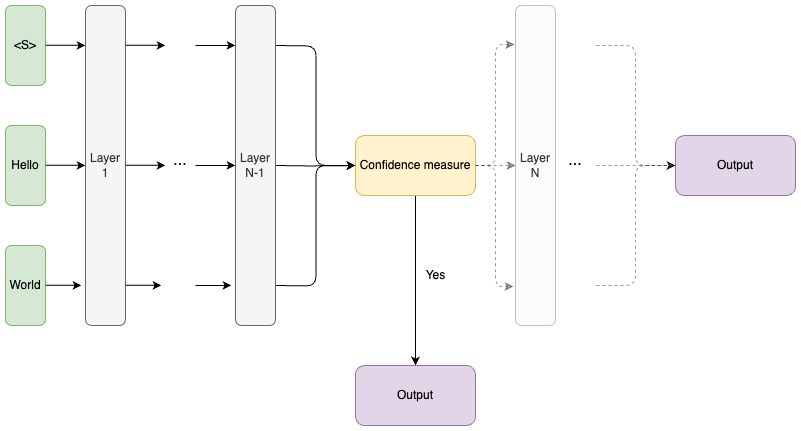
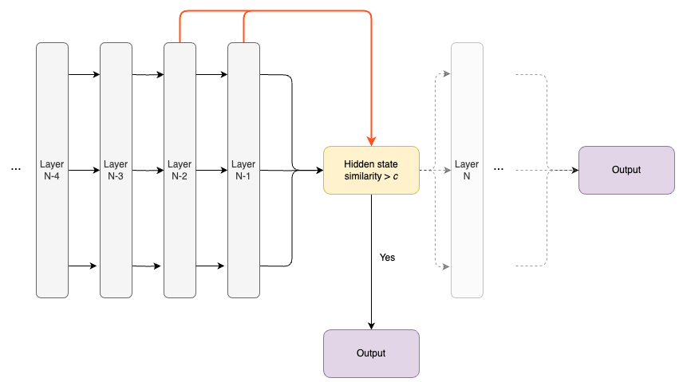
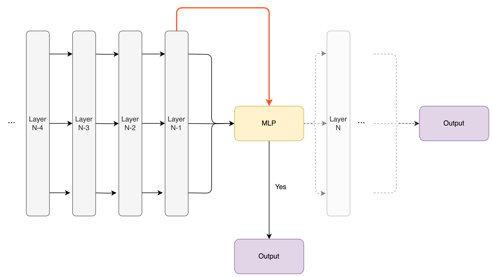
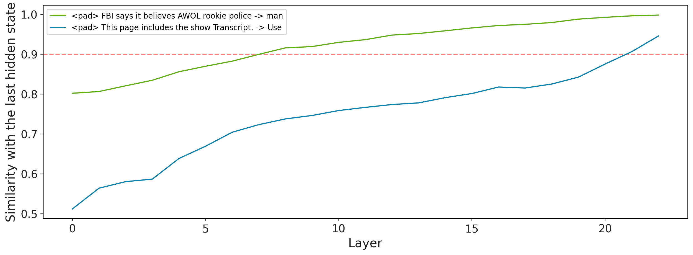
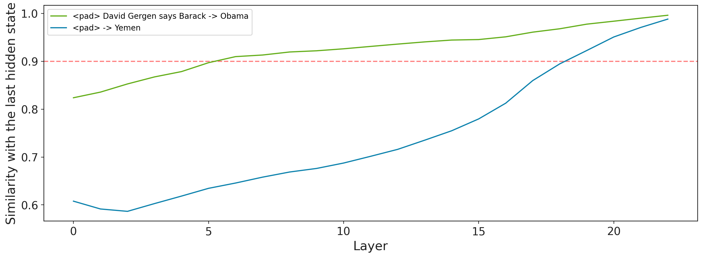
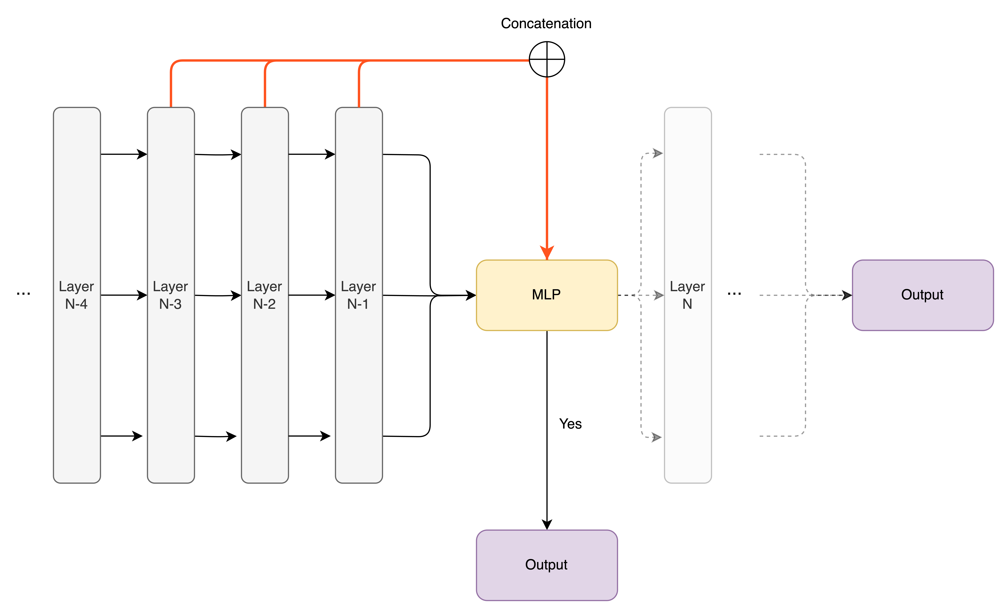
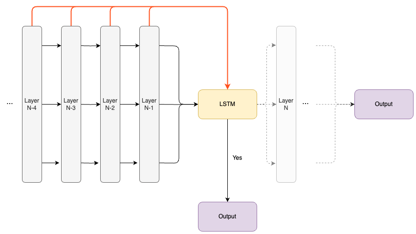
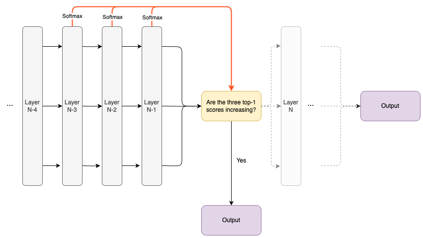

# Exploring Efficiency in Large Language Models: A Journey into Adaptive Computation and Monotonic Early Exiting

### _Filipe Laitenberger, Max Belitsky, Oliver Savolainen, Mark Bodracska, Denys Sheremet_

---
> **When someone asks you what 12 times 17 is, you think for a while. But when someone asks you for your name, you answer without thinking. While this is natural for people, most neural networks don't currently do this. Could they benefit from it as well?**

Large Language Models (LLMs) are capable of things we all thought were impossible two years ago (see GPT[^1] or Gemini[^2]). A primary factor behind this rapid advancement is the substantial increase in the size of the models and datasets used. By expanding the models and providing them with larger datasets, we have been able to achieve unprecedented levels of performance.

However, this progress comes at a significant cost. Training these massive models requires an enormous amount of energy and resources, which in turn leads to substantial environmental impact. For example, GPT-3 consumed 1,287 MWh of energy and emitted 552 tonnes of CO₂ equivalents during its training process[^3][^4]. That's about as much carbon dioxide as 120 average cars emit in a year[^5]. Inference is similarly costly (We also direct the interested reader towards [^6]). 
In addition to that, there are many applications where inference speed is crucial. Examples include autonomous driving or real-time voice assistants, which cannot afford high latency when generating predictions. We do not want our cars to process for two minutes before deciding not to run over a kid.

How can we make AI models faster? One promising direction is to make models allocate their resources more efficiently. Imagine we could teach a model to be smart about how it uses its computational power — only activating certain parts of its network when needed, or knowing when it’s done processing a piece of information early. Drawing an analogy to the human brain, you might think of it as the model being able to choose how long it ponders about a certain decision. This concept is known as adaptive computation allocation. 

One promising approach within this concept is called early exiting. Instead of running every piece of input through every layer of a model, the model can decide to "exit" early if it’s confident enough in its prediction. This way, we save computational resources by not over-processing data. 
In this article, we focus on Transformer models, the backbone of most state-of-the-art language models. For early exiting to work effectively, there’s an underlying assumption: the more a model processes a sequence, the more confident it becomes in its prediction. We call this the *monotonicity assumption*. Essentially, it means that as the model processes information layer by layer, confidence should steadily increase without decreasing again, and the prediction of the model should remain unchanged.

We structure the rest of this blog post into three parts: 
1. The first part explains early exiting.
2. In the second part, we investigate early exiting and its monotonicity assumption. We specifically test for which architectures and loss functions it holds. We then delve into how neural networks process "easy" and "hard" sentences, gaining insight into when early exiting makes sense and when it doesn't.
3. Based on our insights from part 2, we experiment with new early exiting methods.

## 1. What is Early Exiting in Neural Networks?

   
    
   <em><b>Figure 1:</b> The overview of the early exiting framwork.</em>
    

In traditional neural networks, input tokens pass sequentially through many layers, each doing more computation and refining the output. However, early exiting suggests that not all inputs require the same amount of computation. Some "easy" token sequences might be correctly predicted by the earlier layers, while more "difficult" sequences need to go through the entire network. This idea isn't new—it was first explored in convolutional neural networks (CNNs) and has since been applied to Transformer models as well.
Two notable studies that delve into early exiting are CALM[^7] and FREE[^8].

#### CALM: Confident Adaptive Language Modelling

The CALM method fine-tunes a large language model (LLM) using a layerwise weighted cross-entropy objective. 
This objective optimizes each layer to output the correct probabilities for the next token, using a shared language model head across all layers. The loss function for this method is given by:

$$
\mathcal{L} = \sum^L_{i=1} \alpha_i \mathcal{L}_i
\ \ \
\text{where }
\ \ \
\alpha_i = i \ / \ {\sum _{j=1}^{L} j }
$$

Here, $\mathcal{L}_i$ represents the cross-entropy loss at layer $i$, and $\alpha_i$ favors higher layers.

CALM explores three different ways to measure confidence:

**Probability Thresholding**: After each Transformer layer, the model calculates word probabilities from the current hidden state and exits if the difference between the top two probabilities exceeds a calibrated threshold.

   
    
   <em><b>Figure 1:</b> The overview of the early exiting framwork.</em>
    

   
**Hidden State Similarity**: The model computes the similarity between the current hidden state and the previous one, exiting if the similarity surpasses a calibrated threshold.

   
    
   <em><b>Figure 1:</b> The overview of the early exiting framwork.</em>
    

   
**Classifier Prediction**: A classifier predicts the probability of exiting based on the current hidden state.

   
    
   <em><b>Figure 1:</b> The overview of the early exiting framework.</em>
    

Even though [...], a challenge with CALM is handling attention between tokens when some have exited earlier than others, requiring individual copying of hidden states. This slows down the computation. 

#### FREE: Fast and Robust Early Exiting

FREE extends CALM by balancing computational adaptability with reduced overhead. Instead of providing an exit point after every layer, FREE restricts it to two specific points—early in the network and after the final layer. For instance, the model might exit at the fourth layer or use the entire network. This approach allows for the copying of missing hidden states in parallel, reducing the computational burden.

FREE also replaces the calibrated confidence thresholds in CALM with learned ones. In addition to the weighted cross-entropy objective, FREE incorporates a layer-wise knowledge distillation loss:

$$
\mathcal{L}_{KD}= \frac{1}{L_S} \sum _{i=1}^{L_S} \text{MSE} \left( \mathbf{H}_S^i, \mathbf{H}_D^{m(i)} \right)  
$$

In this equation, $\mathbf{H}_S^i$ denotes the hidden state in the shallow module (before the early exit point), and $\mathbf{H}_D^{m(i)}$ denotes the corresponding hidden state in the deep module (after the early exit point). $m(i)$ is usually chosen to successively map the layers in both the shallow and deep modules to one another starting from the end. That is to say, the last layers are mapped to each other, as are the second to last layers, and so on.

## 2. What happens inside an Early Exiting network?

### Do Early Exiting Networks Behave Monotonically?

Now, let's dive deeper into a key assumption underlying early exiting methods: the monotonicity assumption. This assumption posits that as a model processes a token through more layers, its confidence in the prediction for that token should steadily increase. In simpler terms, the more computation the model performs on a token sequence, the more certain it becomes about its prediction.

But why is this assumption so important? Imagine if a model's confidence didn't increase with more processing. Then it would not make sense to exit the network early - the model could be confident of a token at one layer, and then change its prediction entirely in the next layer. That is to say, there would be no way of being sure that the model's prediction at a certain layer is truly reliable.

### Testing the Monotonicity Assumption

The early exiting methods implicitly assume the monotonicity property, but they don’t test whether it holds. So to see if this monotonicity assumption holds, we conduct experiments with three different versions of the T5 model. The T5 model is a common encoder-decoder architecture with 24 layers. 
We test the monotonicity assumption on a T5 model that doesn't use early exiting, one that uses the CALM method, and one that uses the FREE method. 
We use the BigPatent dataset[^9], which is commonly used for summarization tasks. 
 
The monotonicity assumption states that when a model makes a top prediction at a given layer, this prediction will persist as a top prediction through subsequent layers, with the model becoming increasingly confident in this prediction as it progresses.
In other words, there are two parts to this assumption: the prediction remains the same after a given layer, and the model (monotonically) becomes more confident in that prediction with each additional layer. We test both parts of the monotonicity assumption with the following two experiments. 

**Fraction of Stable Predictions**: We measure the fraction of tokens for which the top-1 prediction remains unchanged after each layer. If this fraction is high for a certain layer, it means that at that layer the model has often made a final prediction and doesn't change it in later layers.

   
    
   <em><b>Figure 1:</b> The fraction of predictions that do not change after each respective layer.</em>
    

From the results, we can see that the CALM model often makes a final prediction very early on in the network, and rarely changes its prediction. 
In contrast, the default (no early exit) and FREE models change their predictions much more often in later layers. This indicates that the CALM model may be a better candidate for using early exiting because it is much less likely to change the prediction for a given token. 

**Confidence Over Layers**: We also plot the mean and standard deviation of the model's confidence in its final prediction across layers. This helps us visualize how the model's confidence evolves as the input goes through more layers.

   
    
   <em><b>Figure 2:</b> The mean and standard deviation of the confidence curves for the eventual predictions, plotted at each layer.</em>
    

Figure 2 demonstrates that CALM shows a clear monotonic increase in confidence through the layers. The default model, however, gains confidence much later in the network, and FREE shows a more complex pattern: its confidence increases until the first exit point, drops slightly, and then increases again towards the end. Technically speaking, this means that the monotonicity assumption holds for both the default and CALM models, but the CALM model gains confidence much earlier in the network and therefore seems to be more fit for being used with early exiting. 

The results of these experiments show that the monotonicity assumption holds best for the CALM method. 
This suggests that CALM with its layerwise weighted cross-entropy objective may be the best candidate for early exiting. 
With this method, exiting early at a certain layer has a high likelihood of yielding the same prediction as if the input went through all layers.

### Easy and Difficult Sequences: Understanding Hidden State Saturation
In the previous section, we found that a Transformer model trained with a layerwise weighted cross-entropy objective exhibits a monotonic pattern in token predictions. However, this doesn’t mean the model can confidently exit early on every possible sequence. 
Some sequences are more straightforward ("easy") while others are more ambiguous ("difficult"). For instance, consider the sequence "*One of the biggest cities in the world is New _*". The next word is likely to be "*York*" because it's a well-known fact. In contrast, the sequence "*The students went to _*" is harder to predict without additional context.

To further investigate what happens in early exiting, in this section, we look at which sequences are "easy" for the model, and which are "difficult". We say that a sequence is "easy" if the hidden states at the early layers are almost the same as the ones after the final layer. We call such a hidden state saturated. Intuitively, this means that early on in the forward pass the model has almost the same idea about which token comes next as after the full pass.

We use the CNN Daily Mail summarization dataset, selecting 2500 examples from the validation set. These sequences are fed into a T5 model using the weights from the CALM method in an autoregressive manner, recording the hidden states at each layer. With this procedure, we generate 24 hidden states per sequence, since the T5-large model has 24 layers. We then compute the cosine similarities between the last hidden state (used for the next token prediction) and the hidden states from each previous layer. The obtained similarities show how quickly hidden states saturate. If hidden states of a sequence become similar to the final state after just a few layers (e.g., 4-6 layers), further computation yields minimal benefits. We classify such sequences as "easy". Conversely, sequences requiring almost the entire network to saturate are "difficult". To categorize the sequences, we compute the average similarity between the hidden states from all layers and the final hidden state for each sequence. We then label the 1000 sequences with the highest average similarity as "easy" and the 1000 sequences with the lowest average similarity as "difficult".

Here we are investigating two things: the saturation of the hidden states and the monotonicity of the hidden state similarities. We say that the hidden state is saturated at layer *N* if the cosine similarity between the hidden state of that layer and the hidden state of the last layer in the network is at least 0.9. The threshold of 0.9 was chosen empirically after experimenting with the hidden states of various sequences.

> [!NOTE]
> A saturated hidden state does not imply that the prediction cannot change. Small changes in the hidden state may lead to different predictions. It may be the case that two hidden states with a very high cosine similarity (e.g. 0.999) lead to different predictions.
> Nonetheless, looking at the similarity of hidden states across layers gives us some insight into how feasible early exiting is, and which sequences are "easy" and "difficult" for the network.

|  | Easy sequences | Difficult sequences |
| :--- | :---: | :---: |
| First saturated layer| $8.65(±1.34)$ | $18.46(±0.76)$ |
| Number of saturated layers | $14.35(±1.34)$ | $4.54(±0.76)$ |
| Sequence length | $58.16(±31.81)$ | $11.48(±20.69)$ |
| Monotonic increase in similarity (all layers) | $24$% | $3$% |

Looking at the table above, we can say the following things about "easy" and "difficult" sequences:
 - "Easy" sequences saturate earlier and have a larger number of saturated layers than "difficult" sequences. This means that there are sequences for which we can confidently exit early. 
 - "Easy" sequences tend to be longer than "difficult" ones. This can be explained by the fact that long sequences have more context and may be easier to predict. This information could be used in the early exiting frameworks to speed up the process by only considering early exiting for long sequences.
 - In addition to quicker saturation, a larger fraction of the "easy" sequences show strictly increasing hidden state similarity from the start, compared to "difficult" sequences.

In addition to the quantitative analysis, we plot the hidden state similarities for various sequences, showing how the hidden states evolve across layers for both easy and difficult sequences. These visualizations highlight the differences in saturation and monotonic behavior. In the figure below, we visualize two representative examples exhibiting the behavior described above.

   
   
    
   <em><b>Figure [N]:</b> Examples of how hidden state similarities evolve over layers in "easy" (green) and "difficult" sequences (blue).</em>
    

Going through the "easy" examples, we found that they would be easy for humans to predict. These sequences are generally long, highly contextual, and often represent facts, which remove the ambiguity. The practical implication of this is that an early exit mechanism could benefit from considering sequence length.
Even the easiest sequences require a few initial layers before reaching high confidence, which suggests that the first few layers should not be used for early exits to avoid unnecessary computation of confidence measures.

## 3. Can we improve the confidence measures by explicitly taking monotonicity into account?

After our deep dive into the behavior of hidden states, we realized there’s a lot of potential in leveraging multiple layers' hidden states to improve the early exit decision process. If we train our model with a weighted cross-entropy objective, it encourages a sort of "confidence buildup" layer by layer. This observation leads us to hypothesize that using a combination of hidden states from previous layers, rather than just the current one, could make our exit mechanism more reliable.

We design, train, and test three new confidence measures to put this theory to the test:

**Three-Previous-Hidden-States Classifier**: Here, we use a two-layered MLP that takes in the concatenation of the last three layers' hidden states.

   
    
   <em><b>Figure 1:</b> An MLP that is fed with three hidden states and produces an early exit decision.</em>
    

**LSTM-based Classifier**: This method employs a two-layered LSTM network[^10]. This is similar to the Three-Previous-Hidden-States Classifier, but it utilizes the recurrent architecture to look at all of the previous hidden states.

   
    
   <em><b>Figure 1:</b> An LSTM that sequentially processes the hidden state at each layer.</em>
    

**Heuristic Based on Top-1 Softmax Scores**: This heuristic exits if the last three layers' top-1 softmax scores are monotonically increasing and the current top-1 confidence exceeds 0.9. This heuristic is grounded in our observations from the monotonicity experiments, where such patterns almost always indicate a stable prediction.

   
    
   <em><b>Figure 1:</b> A heuristic that exits if the last three top-1 predictions are increasing and the model is at least 90% confident.</em>
    

### Comparing confidence measures
We use T5 models pre-trained with a weighted cross-entropy objective, tuned for monotonic behavior, to evaluate our methods. 
To get insight into how our proposed new early exiting methods work in various scenarios, we want to test them on Question-Answering, Summarization, and Translation, which are the most popular tasks for LLMs.

1. **Open-book SQuAD 1.1**[^11]: A Question-Answering dataset sourced from Wikipedia articles, supplemented with questions and corresponding answers from the context.
2. **WMT15 EN-FR**[^12]: This dataset contains English sentences paired with their French translations.
3. **CNN/DM**[^13]: A summarization dataset composed of news articles and their target summaries.

#### Baselines and Novel Measures

We compare our new confidence measures against the three baseline methods from CALM:

1. **Top-1 vs. Top-2 Softmax Score Difference**: Exits when the top-1 and top-2 score difference exceeds a threshold.
2. **Hidden-State Saturation**: Measures the change in hidden state similarity across layers.
3. **Single Hidden State Classifier**: A classifier trained on the current hidden state.

To summarize, we are evaluating six different confidence measures, three of which are classifiers that need to be trained before. Therefore, we first train these for five epochs, driving them to output true whenever the current layer's prediction matches the ground-truth target, and "false" otherwise.

The results on the three datasets are shown in the plots below. More specifically, these plots show each confidence measure's performance vs. its latency, i.e., how good it is vs. how fast it is. Performance is measured in different ways (F1, BLEU, and ROUGE-1), but generally, the higher the performance, the more similar its prediction is to the ground truth. Furthermore, latency is measured as the number of tokens the model produces per second. Thus, the closer a point is to the top-right corner of the plot, the better. 

   
    
   <em><b>Figure 1:</b> The results on SQuAD (Question-Answering), measured in F1-score vs. produced samples per second.</em>
    

   
    
   <em><b>Figure 1:</b> The results on IWSLT (Translation), measured in BLEU-score vs. produced samples per second.</em>
    

   
    
   <em><b>Figure 1:</b> The results on CNN/DM (Summarization), measured in ROUGE-1-score vs. produced samples per second.</em>
    

These results show that our proposed confidence measures exhibit much better performance than CALM's confidence, i.e., they are much closer to the top (and the no-early-exiting baseline) than the original measures. However, they also exhibit high latency, mostly even slower than no early exiting.

Where does this leave us? We've gained the insight that making use of monotonicity does benefit the model's performance. Nevertheless, optimizing these confidence measures would still be crucial to making them useful for real-world applications. It seems to make sense to condition a classifier on multiple past hidden states since the classifier can truly make use of this information and arrive at much better-informed exit decisions. On the other hand, the downside of using multiple hidden states seems to be that there is that it creates a lot more overhead as the classifier has to process more information and more memory is used for saving past hidden states.

## Wrapping Up

In this blog post, we deep-dove into the monotonous behavior of early exiting models, first hypothesizing and then showing how and in what situations they become increasingly more confident of a prediction over time. Based on this, we designed new confidence mechanisms that make use of this property and ended up displaying much higher accuracy compared to other confidence measures. Nonetheless, there are still questions remaining that should be addressed through further research:

1. Can we make use of monotonicity and still have the performance benefits of CALM's confidence methods that only look at the current hidden state? This is most likely an engineering problem that requires many additional optimizations that we did not have the time to implement yet.
2. Is early exiting the best way of making a model more efficient? We showed that early exiting crucially depends on this assumption, and that making the model decide on a decision as early as possible benefits the exit mechanism. In other words, we are restricting the model to steer its thinking process in one direction quickly, which takes away the ability to freely ponder. Perhaps, models could benefit from being able to randomly contemplate many different things. There are two further directions we want to mention here: (1) This blog post[^14] and this paper[^15] show that LLMs use their first few layers to randomly explore different "thoughts" while later layers are much more predictable in terms of the end prediction. This leads us to hypothesize that it would be better to constrain the weighted cross entropy objective to just optimize the last ~70% of the model's layers, restricting it less and giving it more time to ponder and explore different directions at first. (2) A very different approach is Mixture-of-Depths[^16] which skips layers instead of exiting altogether. This alleviates the model of having to be monotonous and hence doesn't restrict it at all. It can exhibit completely random behavior, think in many different ways, and at the same time decide to skip certain parts, "specializing" different stages for different processing steps of a token.

## Further Reading

[^1]: OpenAI et al., “GPT-4 Technical Report,” arXiv.org, Mar. 15, 2023. https://arxiv.org/abs/2303.08774

[^2]: G. Team et al., “Gemini: a family of highly capable multimodal models,” arXiv.org, Dec. 19, 2023. https://arxiv.org/abs/2312.11805

[^3]: D. Patterson et al., “Carbon emissions and large neural network training,” arXiv.org, Apr. 21, 2021. https://arxiv.org/abs/2104.10350

[^4]: A. S. Luccioni, S. Viguier, and A.-L. Ligozat, “Estimating the carbon footprint of BLOOM, a 176B parameter language model,” arXiv.org, Nov. 03, 2022. https://arxiv.org/abs/2211.02001

[^5]: United States Environmental Protection Agency EPA. “Greenhouse Gas Emissions from a Typical Passenger Vehicle | US EPA,” US EPA, Aug. 28, 2023. https://www.epa.gov/greenvehicles/greenhouse-gas-emissions-typical-passenger-vehicle

[^6]: P. Li, J. Yang, M. A. Islam, and S. Ren, “Making AI Less ‘Thirsty’: Uncovering and addressing the secret water footprint of AI models,” arXiv.org, Apr. 06, 2023. https://arxiv.org/abs/2304.03271

[^7]: T. Schuster et al., “Confident adaptive language modeling,” arXiv.org, Jul. 14, 2022. https://arxiv.org/abs/2207.07061

[^8]: S. Bae, J. Ko, H. Song, and S.-Y. Yun, “Fast and Robust Early-Exiting Framework for Autoregressive Language Models with Synchronized Parallel Decoding,” arXiv.org, Oct. 09, 2023. https://arxiv.org/abs/2310.05424

[^9]: E. Sharma, C. Li, and L. Wang, “BIGPATENT: a Large-Scale dataset for abstractive and coherent summarization,” arXiv.org, Jun. 10, 2019. https://arxiv.org/abs/1906.03741

[^10]: Sepp Hochreiter and Jürgen Schmidhuber. “Long Short-Term Memory,” MIT Press Journals & Magazine | IEEE Xplore, Nov. 15, 1997. https://ieeexplore.ieee.org/abstract/document/6795963

[^11]: P. Rajpurkar, J. Zhang, K. Lopyrev, and P. Liang, “SQUAD: 100,000+ questions for machine comprehension of text,” arXiv.org, Jun. 16, 2016. https://arxiv.org/abs/1606.05250

[^12]: K. M. Hermann et al., “Teaching machines to read and comprehend,” arXiv.org, Jun. 10, 2015. https://arxiv.org/abs/1506.03340 

[^13]: M. Cettolo et al., “Overview of the IWSLT 2017 Evaluation campaign,” ACL Anthology, 2017. https://aclanthology.org/2017.iwslt-1.1/

[^14]: Nostalgebraist, “interpreting GPT: the logit lens,” Aug. 31, 2020. https://www.lesswrong.com/posts/AcKRB8wDpdaN6v6ru/interpreting-gpt-the-logit-lens

[^15]: C. Wendler, V. Veselovsky, G. Monea, and R. West, “Do llamas work in English? on the latent language of multilingual transformers,” arXiv.org, Feb. 16, 2024. https://arxiv.org/abs/2402.10588

[^16]: D. Raposo, S. Ritter, B. Richards, T. Lillicrap, P. C. Humphreys, and A. Santoro, “Mixture-of-Depths: Dynamically allocating compute in transformer-based language models,” arXiv.org, Apr. 02, 2024. https://arxiv.org/abs/2404.02258
