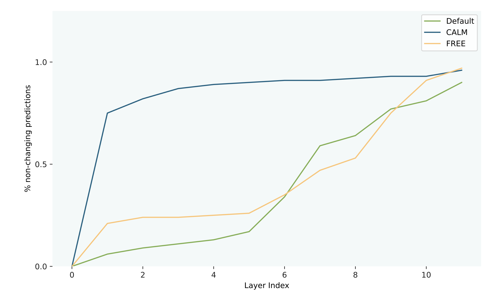
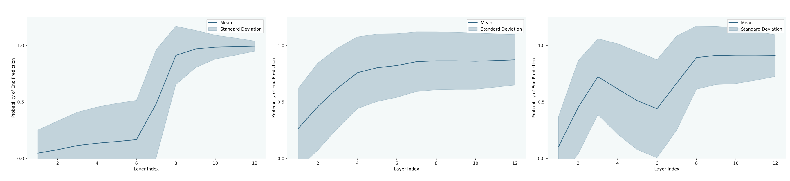
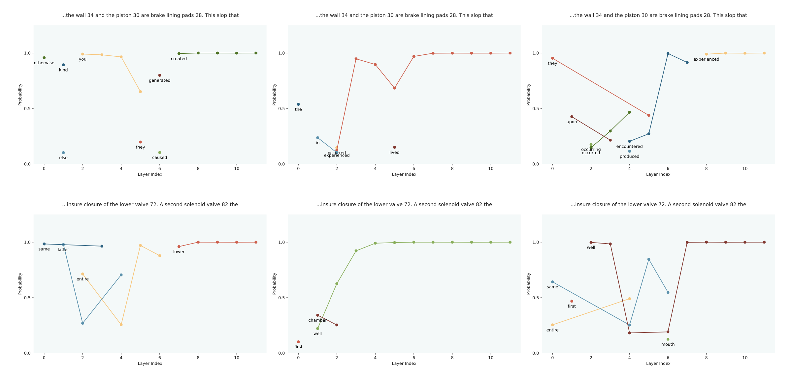

# Monotonic Early Exiting for Fast Inference in Transformer-based Generation

TODO: fix citations and formulas

# Introduction
Large Language Models (LLMs) are showing abilities that are beyond what was deemed possible even two or three years ago \parencite{wei2022emergent, openai2024gpt4, geminiteam2024gemini, touvron2023llama}. These unprecedented results originate from ever-increasing model and dataset sizes, leading to immense consumption of energy and resources, as well environmental pollution \parencite{strubell2019energy, li2023making, patterson2021carbon}. For reference, GPT-3 consumed 1,287 MWh of energy and emitted 552 tonnes of CO$_2$ equivalents \parencite{luccioni2023estimating}, as much as 120 average cars emit per year \parencite{epaGreenhouseEmissions}.

Because of this problem, research has been invested in making LLMs more efficient. One possible way of achieving this is adaptive computation allocation, which can be realized as a network solely utilizing certain sub-networks for specialized tasks \parencite{jiang2024mixtral}, skipping layers \parencite{raposo2024mixtureofdepths} or early exiting a network \parencite{panda2016conditional, teerapittayanon2016branchynet, xin2021berxit, mangrulkar2022be3r, elbayad2019depth, schuster2022confident, bae2023fast, geva2022transformer, del2023skipdecode, elhoushi2024layer}.

The current work focuses on early exiting in Transformers. 
We uncover that early exiting builds on the implicit assumption that the confidence of a model will increase, the more computation it performs on a token, coined the monotonicity assumption. We (1) investigate the monotonicity assumption in prominent early exiting architectures \parencite{schuster2022confident, bae2023fast}. We conclude that a weighted cross-entropy learning objective drives the model to decide on a prediction as early as possible, leading to mostly monotonic behavior after a certain layer.

Based on these two findings, we (2) propose a new early exiting mechanism that exploits monotonic behavior, called Monotonic Early Exiting (MEE). Our method exits based on the hidden states of the last $n$ layers, employing a minimum exit layer.

# Related Work
## The Transformer Architecture
Transformer neural networks \parencite{vaswani2017attention} rely on the attention mechanism \parencite{bahdanau2014neural} for modeling dependencies between tokens in a sequence, e.g. words or image patches. For two tokens A and B, attention is computed as

$$\text{Attention}(Q, K, V) = \text{softmax}\left(\frac{QK^T}{\sqrt{d_k}}\right)V$$

where $Q$ is a learned linear projection of A, $K$ and $V$ are projections of B, and $d_k$ is the number of dimensions in $K$.

The original Transformer architecture consists of two main components: an encoder and a decoder. The encoder computes attention between the input sequence and itself (self-attention), allowing it to capture dependencies between different elements of the input. On the other hand, the decoder incorporates self-attention layers to handle the generated output sequence and cross-attention layers to relate the output sequence to the encoded input tokens. Variations of this encoder-decoder design have been developed, with notable examples including the T5 model \parencite{raffel2020exploring}.

In addition to the traditional encoder-decoder setup, transformer models have also been explored in encoder-only and decoder-only configurations. Encoder-only architectures, exemplified by models like BERT \parencite{devlin2018bert}, are commonly employed for tasks such as sequence embedding. 

Conversely, decoder-only models \parencite{radford2018improving} have been adopted as the standard architecture for large language models (LLMs), showing non-exhaustively improving results at ever-increasing scales (e.g. \cite{brown2020language, openai2024gpt4, geminiteam2024gemini, touvron2023llama, openelm}). Their use extends to multi-modal processing of text, image, video, and many other modalities (e.g. \cite{dosovitskiy2020image, mckinzie2024mm1, sora, girdhar2023imagebind}), making them a strong contester for generally intelligent models, given the necessary scale and data.

Self-attention computes an attention score between each token and every other token in a sequence, resulting in quadratic complexity regarding the sequence length. With model sizes well beyond multiple hundreds of billions of parameters (e.g. \cite{openai2024gpt4, geminiteam2024gemini}), energy and compute increasingly pose a bottleneck for training and inference, motivating lines of research in more efficient model architectures, one of which investigates early exiting.

## Early-Exiting in Neural Networks
While neural networks are traditionally composed of many layers that process an input one after the other, early exiting assumes that not all inputs need the same amount of computation. Consequently, "easy" inputs could be output at earlier layers than "difficult" ones which need to traverse the entire network. Having been pioneered in CNN architectures \parencite{panda2016conditional, teerapittayanon2016branchynet}, early exiting has been studied in Transformers as well, including encoder \parencite{xin2021berxit, mangrulkar2022be3r}, encoder-decoder \parencite{elbayad2019depth, schuster2022confident, bae2023fast} and decoder models \parencite{geva2022transformer, del2023skipdecode, elhoushi2024layer}.\\

We specifically look at two works that aim to model the confidence or uncertainty of a model when generating tokens:

### CALM
\parencite{schuster2022confident} fine-tunes an LLM with a weighted cross-entropy objective that optimizes each layer to output the correct output probabilities given a shared LM-head:

$$
    \mathcal{L} = \sum^L_{i=1} \alpha_i \mathcal{L}_i
    \ \ \ 
    \text{where }
    \ \ \ 
    \alpha_i = \frac{i}{\sum _{j=1}^{L} j }
$$

where $\mathcal{L}_i$ is the cross entropy loss using each layer's hidden state, and $\alpha_i$ favors higher layers according to the equation above.\\
\cite{schuster2022confident} further experiment with three different confidence measures: (1) computing the word probabilities from the current hidden state after each Transformer layer and exiting if the difference between the top two probabilities exceeds a calibrated threshold. (2) computing the closing similarity between the current and last hidden state, and exiting if the similarity surpasses a calibrated threshold. (3) using a classifier that predicts the exit probability based on the current hidden state.\\
However, when computing attention between already generated tokens that were exited earlier than the current one, CALM needs to copy hidden states individually.\

### FREE
\parencite{bae2023fast} extends CALM, trading compute adaptability for decreased overhead. Specifically, it reduces the number of exit points to two compared to every layer so that the model can either exit at, e.g., the fourth layer or use the entire network. Accordingly,  FREE can copy missing hidden states in parallel to reduce overhead. Lastly, FREE replaces the expensively calibrated confidence thresholds used in CALM by learned ones. In addition to the weighted cross-entropy objective, FREE uses a layerwise knowledge distillation loss 

$$ \mathcal{L}_{\mathrm{KD}}= \frac{1}{\left|L_S\right|} \sum _{i=1}^{L_S} \text{MSE}\left(\mathbf{H}_S^i, \mathbf{H}_D^{m(i)}\right) $$

where $\mathbf{H}_S^i$ refers to a layer in the shallow module, i.e., the layers before the early exit point, and $\mathbf{H}_D^{m(i)}$ refers to a layer in the deep module, i.e., the layers after the early exit point. $m(i)$ either (1) maps the last layer, (2) is a uniform mapping from shallow to deep layers, or (3) maps to the closest hidden state in the deep module, i.e., $m(i)=\underset{j}{\arg \min } \text{MSE}\left(\mathbf{H}_S^i, \mathbf{H}_D^j\right)$.

# Do Early-Exiting Networks Behave Monotonically?
All the methods discussed assume that confidence evolves monotonically, i.e., that the model will be more certain of a prediction the more computation it performs on a token. This assumption is central to the functioning of early exit methods regarding the decision when to exit and whether it is sensible to exit early in the first place - it could be that the evolvement of hidden states is utterly unpredictable and does not resemble any meaningful connection to the eventual word probabilities at the final layer, i.e., the network might be a black box whose intermediate representations are meaningful to itself but not to the outside world. On the other hand, it might be that intermediate hidden states can be seen as "contemplation" of the model, or that the model even tries to decide on a prediction as early as possible in its contemplation process.

### Experiment
To test whether this monotonicity assumption holds, we conduct an experiment on three different settings of a T5 model - a default variant without early exiting, a CALM model optimized on the weighted cross-entropy objective, and a FREE model that uses the additional layerwise knowledge distillation term. 
For each model, we use publicly available pre-trained checkpoints and evaluate each model on summarization using the BigPatent dataset \parencite{sharma2019bigpatent}. 
Specifically, we leverage the models' LM-heads after each of the twelve layers to compute two things: 
(1) the fraction of tokens for which the prediction does not change after the respective layer, i.e., whether the model could have exited early at the respective layer without a loss in accuracy. 
(2) A plot showing the mean and standard deviation of the confidence in the eventual prediction at each layer. 
(3) Plots showing the top-3 predictions at each layer for individual token generations.

### Results 
(1) Figure 1 shows that at the second layer already, the weighted cross entropy objective optimizes the model to be confident of a token, i.e. not change its top-1 prediction after layer two, in 75\% of the cases.
Additionally, after the fourth layer, the model keeps its prediction in 90\% of the cases. Contrastingly, the default T5 and even FREE exhibit much less certainty in their predictions. Even though FREE uses the weighted cross-entropy objective as well, its additional layerwise distillation objective seems to be inhibiting the same monotonic behavior as in CALM.

*Figure 1: The fraction of top-1 predictions that do not change after each layer, measured across the BigPatent evaluation dataset*.

(2) In addition, figure \ref{fig:mean-top1-curves} demonstrates that CALM increases monotonically in its top-1 prediction at early layers on average. Meanwhile, the vanilla T5 gains confidence much later. On the other hand, FREE displays locally monotonic behavior, i.e., its confidence increases until its first exit point, then drops and increases again until the end of the network.

*Figure 2: The mean and standard deviation of the end prediction across the BigPatent evaluation dataset, with the default T5 on the left, CALM in the middle, and FREE on the right.*.

(3) To illustrate this behavior in individual cases, figure \ref{fig:examples-monotonicity} depicts three example forward passes of the same sequence for the three models, with the default T5 on the left, CALM in the middle, and FREE on the right. The plots exemplify the rather unpredictable behavior of the default and FREE models, while CALM decides on a prediction as early as possible. While CALM's confidence increase shows slightly non-monotonic evolvement in earlier layers, the plots exemplify its monotonicity in later layers.

*Figure 3: The top-3 word predictions from forward passes of a default Transformer (left), CALM (middle), and FREE (right), with the x-axis indicating the layer, and the y-axis indicating predicted probability.*.

### Conclusion
We show that the weighted cross-entropy objective encourages the model to decide on a prediction as early as possible while exhibiting monotonically increasing behavior in its predictions. These results indicate that an early exit mechanism could benefit from taking this behavior into account, exiting early based on whether it observes monotonically increasing predictions.

# Proposed Method: Monotonic Early Exiting (MEE)
Based on our observations above, we hypothesize that an exit mechanism could improve if conditioned on multiple previous layers' hidden states. If the model is trained using the weighted cross-entropy objective, the monotonic patterns in the hidden states could inform the exit mechanism to be more confident of a decision based on the evolvement of hidden states rather than just the current hidden state. Henceforth, we develop, train, and test three new confidence measures:

### LSTM-based classifier
A two-layered LSTM network \parencite{LSTM} with the input dimensionality equal to the transformer's hidden dimensionality, and two outputs representing exit and no-exit.

### Classifier based on three previous hidden states
A two-layered MLP with three times the transformer's hidden dimensionality as inputs, ReLU activation \parencite{RELU}, the transformer's hidden dimensionality as hidden neurons, and two outputs representing exit and no-exit.

### A heuristic method based on the last three top-1 softmax scores
The network makes an exit decision if and only if the last three layer's softmax scores are monotonically increasing and above $0.9$. This handcrafted rule is based on the observations from our monotonicity experiments where three consecutively increasing top-1 scores above the named threshold would almost never change later on.

For all confidence measures, we set a minimum exit layer of four. We further hypothesize that the accuracy of the generation will be higher due to the increased accuracy of exit decisions and that latency will be higher due to increased computational complexity.

### Comparison to FREE
FREE is less adaptive than CALM but also less computationally expensive, due to the limited number of two exit points. With the minimum exit layer of four, we aim to strike a balance between computational adaptability and complexity, informed by the behavior of monotonicity observed in the models.

### Comparison to CALM
With its hidden state saturation confidence measure, CALM experiments with one measure informed by the current and previous hidden state, similar to our method. Our endeavors into hidden state saturation reveal its frequent presence. However, there may be cases without hidden state saturation even though the model is confident of a token, as very different hidden states can lead to the same softmax scores. This further motivates our classifier-based confidence measures conditioned on previous hidden states, which can recover the hidden state saturation behavior, and go beyond it if necessary.

# Experiments
### Model
For all experiments, we use T5 models pre-trained on a weighted-cross entropy objective for monotonic behavior

### Datasets
We evaluate three datasets: (1) Open-book SQuAD 1.1 \parencite{rajpurkar2016squad}, a QA dataset out of Wikipedia articles complemented with questions and a target answer which is taken from the context article. (2) CNN/DM \parencite{hermann2015teaching}, composed of news articles and target summarizations. (3) WMT15 EN-FR \parencite{bojar2014findings}, containing English sentences and target French translations.

### Baselines
We test the three confidence measures proposed by CALM: (1) The difference between top-1 and top-2 softmax score, (2) hidden-state saturation, and (3) a classifier trained on the current hidden state.

### Novel Confidence Measures
We additionally test our three proposed confidence measures, comparing them to the three baselines.

