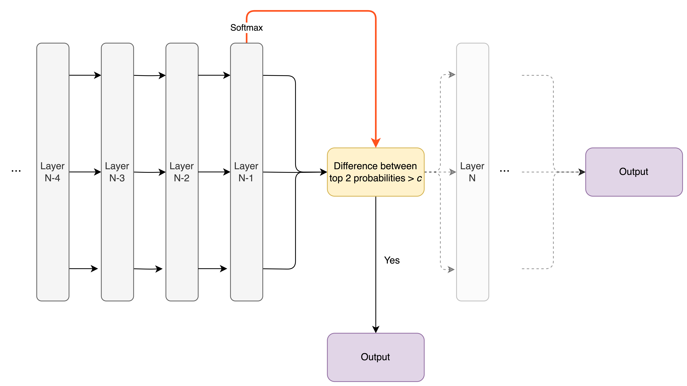

# Monotonic Early Exiting for Fast Inference in Transformer-based Generation 

### _Filipe Laitenberger, Max Belitsky, Oliver Savolainen, Mark Bodracska, Denys Sheremet_

---
**Exploring Efficiency in Large Language Models: A Journey into Adaptive Computation and Monotonic Early Exiting**

Large Language Models (LLMs) exhibit exceptional performance. The primary factor behind this rapid advancement is the substantial increase in the size of the models and datasets used. By expanding the models and providing them with larger datasets, we have been able to achieve unprecedented levels of performance.

However, this progress comes at a significant cost. Training these massive models requires an enormous amount of energy and resources, which in turn leads to substantial environmental impact. For example, GPT-3 consumed 1,287 MWh of energy and emitted 552 tonnes of CO₂ equivalents during its training process. That's about as much carbon dioxide as 120 average cars emit in a year. Furthermore, many applications, such as autonomous driving or real-time voice assistants, cannot afford high latency when generating predictions.

How can we continue to advance AI while avoiding a high-latency bottleneck? One promising direction is to make models allocate their resources more efficiently. Imagine we could teach a model to be smart about how it uses its computational power — only activating certain parts of its network when needed, or knowing when it’s done processing a piece of information early. Drawing an analogy to the human brain, you might think of it as the model being able to choose how long it ponders about a certain thing, so that we can optimize it to contemplate for as little time as possible. This concept is known as adaptive computation allocation.

One promising approach within this concept is called early exiting. Instead of running every piece of input through every layer of a model, the model can decide to "exit" early if it’s confident enough in its prediction. This way, we save computational resources by not over-processing data. 

In this work, we focus on Transformer models, the backbone of most state-of-the-art language models. For early exiting to work effectively, there’s an underlying assumption: the more a model processes a token, the more confident it becomes in its prediction. We call this the *monotonicity assumption*. Essentially, it means that as the model processes information layer by layer, confidence should steadily increase without decreasing again. [also, say that it shouldnt change its prediction]

In the first part of this blog post, we want to give an introduction to early exiting, explaining it and its evolution in more depth. 
Moreover, we performed interesting investigations into the inner workings of common early exiting architectures, presented in the second part. 
Lastly, based on our investigations, we've come up with new ways of improving early exiting architectures, which we will show at the end.

We struture rest of this blog post into three parts: 
1. The first part explains early exiting and its evolution in more depth.
2. In the second part, we investigate deeper into early exiting and its monotonicity assumption. We specifically test for which architectures and especially loss functions it holds and for which it doesn't. We furthermore delve into how neural networks process "easy" and "hard" sentences, gaining insights into when early exiting makes more sense and when it doesn't.
3. Based on our insights from section 2, we experiment with new early exiting methods.

## 1. Early Exiting in Neural Networks

   
    
   <em><b>Figure 1:</b> The overview of the early exiting framwork.</em>
    

In traditional neural networks, input tokens pass sequentially through many layers, each adding more processing and refining the output. However, early exiting suggests that not all inputs require the same level of computation. Some "easy" token sequences might be confidently processed by the earlier layers, while more "difficult" sequences need to go through the entire network. This idea isn't new—it was first explored in convolutional neural networks (CNNs) and has since been applied to Transformer models as well.
Two notable studies that delve into early exiting by modeling the confidence or uncertainty of a model when generating tokens are CALM and FREE.

#### CALM: Confident Adaptive Language Modelling

The CALM method fine-tunes a large language model (LLM) using a weighted cross-entropy objective. This objective optimizes each layer to output the correct probabilities for the next token, using a shared language model head across all layers. The loss function for this method is given by:

$$
\mathcal{L} = \sum^L_{i=1} \alpha_i \mathcal{L}_i
\ \ \
\text{where }
\ \ \
\alpha_i = i \ / \ {\sum _{j=1}^{L} j }
$$

[TODO: check whether all of the formulas are correct]

Here, $\mathcal{L}_i$ represents the cross-entropy loss at layer $i$, and $\alpha_i$ are weights that favor higher layers.

CALM explores three different ways to measure confidence:

**Probability Thresholding**: After each Transformer layer, the model calculates word probabilities from the current hidden state and exits if the difference between the top two probabilities exceeds a calibrated threshold.

   
    
   <em><b>Figure 1:</b> The overview of the early exiting framwork.</em>
    

   
**Hidden State Similarity**: The model computes the similarity between the current hidden state and the previous one, exiting if the similarity surpasses a calibrated threshold.

   
    
   <em><b>Figure 1:</b> The overview of the early exiting framwork.</em>
    

   
**Classifier Prediction**: A classifier predicts the probability of exiting based on the current hidden state.

   
    
   <em><b>Figure 1:</b> The overview of the early exiting framwork.</em>
    

A challenge with CALM is handling attention between tokens when some have exited earlier than others, requiring individual copying of hidden states.

#### FREE: Fast and Robust Early Exiting

FREE extends CALM by balancing computational adaptability with reduced overhead. Instead of providing an exit point after every layer, FREE restricts it to two specific points—early and at the end of the network. For instance, the model might exit at the fourth layer or use the entire network. This approach allows for copying of missing hidden states in parallel, reducing the computational burden.

FREE also replaces the calibrated confidence thresholds in CALM with learned ones. In addition to the weighted cross-entropy objective, FREE incorporates a layer-wise knowledge distillation loss:

$$
\mathcal{L}_{KD}= \frac{1}{L_S} \sum _{i=1}^{L_S} \text{MSE} \left( \mathbf{H}_S^i, \mathbf{H}_D^{m(i)} \right)  
$$

In this equation, $\mathbf{H}_S^i$ denotes the hidden state in the shallow module (before the early exit point), and $\mathbf{H}_D^{m(i)}$ denotes the corresponding hidden state in the deep module (after the early exit point). The mapping $m(i)$ can take various forms:

[Usually the last layer of the shallow module is mapped to the last layer of the deep module and so on.]

## 2. Our Investigations Into the Inner Workings of Early Exiting

### Do Early-Exiting Networks Behave Monotonically?

Now, let's dive deeper into a key assumption underlying early exiting methods: the monotonicity assumption. This assumption posits that as a model processes a token through more layers, its confidence in the prediction for that token should steadily increase. In simpler terms, the more computation the model performs on a token, the more certain it becomes about a prediction.

But why is this assumption so important? Imagine if a model's confidence didn't increase with more processing. Then it would not make sense to exit the network early - the model could be confident of a token at one layer, and then change its prediction entirely in the next layer. That is to say, there would be no way of being sure that the model's prediction at a certain layer is truly reliable. On the other hand, it seems intuitive that, the more the model thinks about something, the more reliable its prediction is.

### Testing the Monotonicity Assumption

The early exiting methods implicitly assume the monotonicity property, but they don’t test whether it actually holds. So to see if this monotonicity assumption holds, we conduct an experiment with three different settings of the T5 model:

1. **Default T5**: The standard model without any early exiting mechanism.
2. **CALM**: A model optimized with a weighted cross-entropy objective to favor predictions from higher layers.
3. **FREE**: An extended version of CALM that includes a layer-wise knowledge distillation loss to refine the early exiting process.

We evaluate these models using the BigPatent dataset, which is commonly used for summarization tasks. Here's how we test the monotonicity assumption:

1. **Fraction of Stable Predictions**: We measure the fraction of tokens for which the top-1 prediction remains unchanged after each layer. If a model can make a correct prediction early on and maintain it, this suggests that the model's confidence is indeed increasing with more computation.

   
    
   <em><b>Figure 1:</b> The fraction of predictions that do not change after each respective layer.</em>
    

The results shown in Figure 1 indicate that the CALM model rapidly gains confidence. By the second layer, CALM's top-1 prediction stabilizes for a significant fraction of tokens. By the fourth layer, it maintains its prediction for most tokens. In contrast, the default T5 and FREE models exhibit much less certainty, indicating less monotonic behavior.

2. **Confidence Over Layers**: We plot the mean and standard deviation of the model's confidence in its final prediction across layers. This helps us visualize how the model's confidence evolves as it processes more layers.

   
    
   <em><b>Figure 2:</b> The mean and standard deviation of the confidence curves for the eventual predictions, plotted at each layer.</em>
    

Figure 2 demonstrates that CALM shows a clear monotonic increase in confidence as it processes more layers. The vanilla T5 model, however, gains confidence much later in the network, while FREE shows a more complex pattern: its confidence increases until the first exit point, drops slightly, and then increases again towards the end.

Figure 3 illustrates three example forward passes of the same sequence for the three models. The default T5 shows unpredictable changes in its top predictions across layers. FREE also displays non-monotonic behavior but to a lesser extent. CALM, on the other hand, decides on a prediction early and sticks with it, demonstrating more consistent confidence growth.

### Conclusion

These results suggest that the weighted cross-entropy objective in CALM encourages the model to decide on predictions as early as possible, exhibiting a predominantly monotonic increase in confidence. This behavior supports the feasibility of early exiting mechanisms. By leveraging this monotonic confidence growth, models can exit early, saving computational resources without sacrificing accuracy. 

### Easy and Difficult Sequences: Understanding Hidden State Saturation

In the previous section, we explored how a Transformer model, trained with a weighted cross-entropy objective, exhibits a monotonic pattern in token predictions. However, this doesn’t mean the model can confidently exit early on every possible sequence. Some sequences are more straightforward ("easy") while others are more ambiguous ("difficult"). For instance, consider the sequence "One of the biggest cities in the world is New _". The next word is likely to be "York" because it's a well-known fact. In contrast, the sequence "The students went to _" is harder to predict without additional context.

### Investigating Hidden States: Easy vs. Difficult Sequences

To understand the properties of hidden states in a monotonic network and their relation to sequence difficulty, we conducted a second experiment. We used the CNN Daily Mail summarization dataset, selecting 2500 examples from the validation set. These sequences were fed into a T5 model in an autoregressive manner, recording the hidden states at each layer. This procedure generated 24 hidden states per sequence, given the T5 model has 24 layers.

#### Experiment Details

1. **Cosine Similarity of Hidden States**: We computed the cosine similarity between the last hidden state (used for next token prediction) and the hidden states from each previous layer. This similarity vector shows how quickly hidden states saturate. If hidden states become similar to the final state after just a few layers (e.g., 4-6 layers), further computation yields minimal benefits. We classify such sequences as "easy". Conversely, sequences requiring almost the entire network to saturate are labeled "difficult".

2. **Identifying Easy and Difficult Sequences**: We calculated the mean similarity for each sequence. We labeled the 1000 sequences with the highest mean similarity as "easy" and the 1000 sequences with the lowest mean similarity as "difficult".

3. **Metrics Computed**: We analyzed the following metrics:
   - **Index of the First Saturated Layer**: The layer where hidden states first reach high similarity.
   - **Number of Similar Hidden States**: The total number of layers where hidden states are similar to the final state.
   - **Sequence Length**: Average length of sequences.
   - **Monotonicity Indicator**: Whether hidden state similarities strictly increase after layers 0, 4, and 8.

#### Results and Observations

1. **Layer Index and Hidden State Saturation**:
   - Easy sequences saturate much earlier, around layer 8.65 on average.
   - Difficult sequences saturate much later, around layer 18.46, close to the model’s final layer.

2. **Number of Similar Hidden States**:
   - Easy sequences have a larger number of similar hidden states (14.35 on average).
   - Difficult sequences have fewer similar hidden states (4.54 on average).

3. **Sequence Length**:
   - Easy sequences tend to be longer (58.16 tokens on average). 
   - Difficult sequences are shorter (11.48 tokens on average).

4. **Monotonicity of Hidden States**:
   - A significant portion of easy sequences shows strictly increasing hidden state similarity from the start.
   - Difficult sequences exhibit monotonic behavior later, with a noticeable increase after layers 4 and 8.

[We should explain what these results imply (e.g. 3. Can be explained by that long sequences have more context and therefore are easier to predict. 1&2 imply that there exist sequences for which we can confidently early exit. 4 provides additional evidence for the monotonicity assumption.)]

#### Visualizing Hidden State Evolution

To better illustrate these findings, we plotted the hidden state similarities for various sequences, showing how the hidden states evolve across layers for both easy and difficult sequences. These visualizations highlight the differences in saturation and monotonic behavior.

[Add the plots]

### Conclusion

Our analysis indicates that an early exit mechanism can benefit from considering sequence length and the early layers’ computation. Even the easiest sequences require a few initial layers before reaching high confidence, suggesting that the first few layers should not be used for early exits to avoid unnecessary computation on confidence measures. This understanding helps refine early exiting mechanisms, optimizing resource use without sacrificing performance.

### Making use of the monotonicity assumption for early exiting

After our deep dive into the behavior of hidden states, we realized there’s a lot of potential in leveraging multiple layers' hidden states to improve the early exit decision process. If we train our model with a weighted cross-entropy objective, it encourages a sort of "confidence buildup" layer by layer. This observation led us to hypothesize that using a combination of hidden states from previous layers, rather than just the current one, could make our exit mechanism more reliable.

We designed, trained, and tested three new confidence measures to put this theory to the test:

**Three-Previous-Hidden-States Classifier**: Here, we use a two-layered MLP. The input comprises three times the transformer's hidden dimensionality, corresponding to three consecutive hidden states. This is the same as what was used in the [....CALM/FREE.....] paper, but here the classifier looks at the last three hidden states instead of only the last one. With ReLU activation and a hidden layer matching the transformer's dimensionality, this classifier aims to leverage more context from the model's internal states.

   
    
   <em><b>Figure 1:</b> The overview of the early exiting framwork.</em>
    

**LSTM-based Classifier**: This method employs a two-layered LSTM network. This is similar to the Three-Previous-Hidden-States Classifier, but it utilizes the recurrent architecture to look at all of the previous hidden states. 

   
    
   <em><b>Figure 1:</b> The overview of the early exiting framwork.</em>
    

**Heuristic Based on Top-1 Softmax Scores**: This heuristic exits if the last three layers' top-1 softmax scores are monotonically increasing and the current top-1 confidence exceeds 0.9. This heuristic is grounded in our observations from the monotonicity experiments, where such patterns almost always indicated a stable prediction.

   
    
   <em><b>Figure 1:</b> The overview of the early exiting framwork.</em>
    

For each confidence measure, we set a minimum exit layer at four, based on our understanding that even the simplest sequences need a few initial layers to build confidence.

### Comparing confidence measures
We use T5 models pre-trained with a weighted cross-entropy objective, tuned for monotonic behavior, to evaluate our methods. The datasets include:

1. **Open-book SQuAD 1.1**: A QA dataset sourced from Wikipedia articles, supplemented with questions and corresponding answers from the context.
2. **CNN/DM**: Comprising news articles and their summaries, perfect for testing summarization tasks.
3. **WMT15 EN-FR**: This dataset contains English sentences paired with their French translations, ideal for translation tasks.

#### Baselines and Novel Measures

We compare our new confidence measures against the three baseline methods from CALM:

1. **Top-1 vs. Top-2 Softmax Score Difference**: Exits when the top-1 and top-2 score difference exceeds a threshold.
2. **Hidden-State Saturation**: Measures the change in hidden state similarity across layers.
3. **Single Hidden State Classifier**: A classifier trained on the current hidden state.

We use a threshold value of 0.9, inspired by the FREE repository, and apply decaying threshold temperatures of 4 for each dataset.

We train the proposed classifiers using the loss function proposed for the CALM classifier, running for five epochs to ensure robustness.

## References

[1] Josh Achiam et al. GPT-4 Technical Report. 2024. arXiv: 2303.08774 [cs.CL].

[2] Abien Fred Agarap. "Deep Learning using Rectified Linear Units (ReLU)". In: CoRR abs/1803.08375 (2018). arXiv: 1803.08375, URL: http://arxiv.org/abs/1803.08375.

[3] Rohan Anil et al. Gemini: A Family of Highly Capable Multimodal Models. 2024. arXiv: $2312.11805[$ cs.CL],

[4] Sangmin Bae et al. "Fast and robust early-exiting framework for autoregressive language models with synchronized parallel decoding". In: arXiv preprint arXiv:2310.05424 (2023).

[5] Dzmitry Bahdanau, Kyunghyun Cho, and Yoshua Bengio. "Neural machine translation by jointly learning to align and translate". In: arXiv preprint arXiv:1409.0473 (2014).

[6] Ondřej Bojar et al. "Findings of the 2014 workshop on statistical machine translation". In: Proceedings of the ninth workshop on statistical machine translation. 2014, pp. 12-58.

[7] Tim Brooks et al. Video generation models as world simulators. https://openai . com/ index/video-generation-models-as-world-simulators. [Accessed 06-05-2024]. 2024.

[8] Tom Brown et al. "Language models are few-shot learners". In: Advances in neural information processing systems 33 (2020), pp. 1877-1901.

[9] Luciano Del Corro et al. "Skipdecode: Autoregressive skip decoding with batching and caching for efficient llm inference". In: arXiv preprint arXiv:2307.02628 (2023).

[10] Jacob Devlin et al. "Bert: Pre-training of deep bidirectional transformers for language understanding". In: arXiv preprint arXiv:1810.04805 (2018).

[11] Alexey Dosovitskiy et al. "An image is worth 16x16 words: Transformers for image recognition at scale". In: arXiv preprint arXiv:2010.11929 (2020).

[12] Maha Elbayad et al. "Depth-adaptive transformer". In: arXiv preprint arXiv:1910.10073 $(2019)$.

[13] Mostafa Elhoushi et al. "Layer Skip: Enabling Early Exit Inference and Self-Speculative Decoding". In: arXiv preprint arXiv:2404.16710 (2024).

[14] United States Environmental Protection Agency EPA. Greenhouse Gas Emissions from a Typical Passenger Vehicle - US EPA - epa.gov. [Accessed 13-05-2024]. 2023. URL: https: //www . epa . gov/greenvehicles/greenhouse-gas - emissions - typical - passenger vehicle\#typical-passenger.

[15] Mor Geva et al. "Transformer feed-forward layers build predictions by promoting concepts in the vocabulary space". In: arXiv preprint arXiv:2203.14680 (2022).

[16] Rohit Girdhar et al. "Imagebind: One embedding space to bind them all". In: Proceedings of the IEEE/CVF Conference on Computer Vision and Pattern Recognition. 2023, pp. 1518015190.

[17] Ian Goodfellow, Yoshua Bengio, and Aaron Courville. Deep Learning.http://www.deeplearningbook. org. MIT Press, 2016.

[18] Karl Moritz Hermann et al. "Teaching machines to read and comprehend". In: Advances in neural information processing systems 28 (2015).

[19] Sepp Hochreiter and Jürgen Schmidhuber. "Long Short-term Memory". In: Neural computation 9 (Dec. 1997), pp. 1735-80. DOI: $10.1162 /$ neco.1997.9.8.1735

[20] Albert Q. Jiang et al. Mixtral of Experts. 2024. arXiv: 2401.04088 [cs.LG]

[21] Pengfei Li et al. "Making ai less" thirsty": Uncovering and addressing the secret water footprint of ai models". In: arXiv preprint arXiv:2304.03271 (2023).

[22] Alexandra Sasha Luccioni, Sylvain Viguier, and Anne-Laure Ligozat. "Estimating the carbon footprint of bloom, a 176b parameter language model". In: Journal of Machine Learning Research 24.253 (2023), pp. 1-15.

[23] Sourab Mangrulkar, Ankith MS, and Vivek Sembium. "BE3R: BERT based Early-Exit Using Expert Routing". In: Proceedings of the 28th ACM SIGKDD Conference on Knowledge Discovery and Data Mining. 2022, pp. 3504-3512.

[24] Brandon McKinzie et al. MM1: Methods, Analysis Insights from Multimodal LLM Pretraining. 2024. arXiv: 2403.09611 [cs.CV].

[25] Sachin Mehta et al. OpenELM: An Efficient Language Model Family with Open Training and Inference Framework. 2024. URL: https://arxiv.org/abs/2404.14619.

[26] Priyadarshini Panda, Abhronil Sengupta, and Kaushik Roy. "Conditional deep learning for energy-efficient and enhanced pattern recognition". In: 2016 Design, Automation & Test in Europe Conference & Exhibition (DATE). IEEE. 2016, pp. 475-480.

[27] David Patterson et al. "Carbon emissions and large neural network training". In: arXiv preprint arXiv:2104.10350 (2021).

[28] Alec Radford et al. "Improving language understanding by generative pre-training". In: $(2018)$.

[29] Colin Raffel et al. "Exploring the limits of transfer learning with a unified text-to-text transformer". In: Journal of machine learning research 21.140 (2020), pp. 1-67.

[30] Pranav Rajpurkar et al. "Squad: 100,000+ questions for machine comprehension of text". In: arXiv preprint arXiv:1606.05250 (2016).

[31] David Raposo et al. Mixture-of-Depths: Dynamically allocating compute in transformer-based language models. 2024. arXiv: 2404.02258 [cs.LG],

[32] Tal Schuster et al. "Confident adaptive language modeling". In: Advances in Neural Information Processing Systems 35 (2022), pp. 17456-17472.

[33] Abigail See, Peter J. Liu, and Christopher D. Manning. "Get To The Point: Summarization with Pointer-Generator Networks". In: Proceedings of the 55th Annual Meeting of the Association for Computational Linguistics (Volume 1: Long Papers). Vancouver, Canada: Association for Computational Linguistics, July 2017, pp. 1073-1083. DOI: 10.18653/v1/P17-1099. URL: https://www.aclweb.org/anthology/P17-1099.

[34] Eva Sharma, Chen Li, and Lu Wang. "BIGPATENT: A large-scale dataset for abstractive and coherent summarization". In: arXiv preprint arXiv:1906.03741 (2019).

[35] Emma Strubell, Ananya Ganesh, and Andrew McCallum. "Energy and policy considerations for deep learning in NLP". In: arXiv preprint arXiv:1906.02243 (2019).

[36] Surat Teerapittayanon, Bradley McDanel, and Hsiang-Tsung Kung. "Branchynet: Fast inference via early exiting from deep neural networks". In: 2016 23rd international conference on pattern recognition (ICPR). IEEE. 2016, pp. 2464-2469.

[37] Hugo Touvron et al. "Llama: Open and efficient foundation language models". In: arXiv preprint arXiv:2302.13971 (2023).

[38] Ashish Vaswani et al. "Attention is all you need". In: Advances in neural information processing systems $30(2017)$.

[39] Jason Wei et al. "Emergent abilities of large language models". In: arXiv preprint arXiv:2206.07682 $(2022)$.

[40] Ji Xin et al. "BERxiT: Early exiting for BERT with better fine-tuning and extension to regression". In: Proceedings of the 16th conference of the European chapter of the association for computational linguistics: Main Volume. 2021, pp. 91-104.

